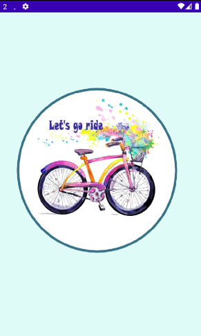
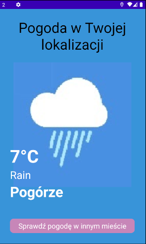
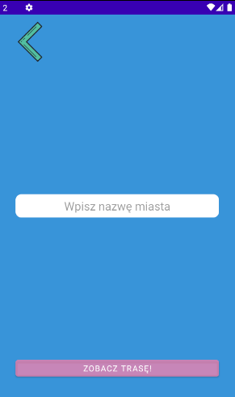
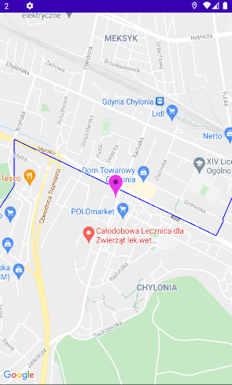

# Let's go Ride
> Aplikacja dla rowerzystów do sprawdzania pogody i wyznaczania tras.
## Spis treści
* [Informacje ogólne](#Informacje-ogólne)
* [Dokumentacja](#dokumentacja)
* [Technologia](#Technologie)
* [Przykład kodu](#przykład-kodu)
* [Funkcjonalności](#Funkcjonalności)
* [Status](#status)
* [Kontakt](#kontakt)
## Informacje ogólne
Add more general information about project. What the purpose of the project is? Motivation?
Aplikacja ma na celu ułatwienie rowerzystom
> Applikacja umożliwia pokazanie aktualnej pogody w Twojej lokalizacji oraz wybranie innej lokalizacji i pokazanie pogody. 
> Aplikacja umożliwia pokazanie trasy rowerowej i naszej obecnej lokalizacji.
## Dokumentacja




## Technologie
* Android Studio 4.1.1
* Android SDK 10.0(Q) API Level 29
* OpenWeatherMap API
* Google maps API
* Google directions API
## Przykład kodu
* Załadowanie pogody dla aktualnej lokalizacji:
```ruby
private static String updateWeatherIcon(int condition)
    {
        if(condition>=0 && condition<=300)
        {
            return "thunderstorm";
        }
        else if(condition>300 && condition<=500)
        {
            return "lightrain";
        }
        else if(condition>=500 && condition<=600)
        {
            return "shower";
        }
        else if(condition>=600 && condition<=700)
        {
            return "snownight";
        }
        else if(condition>=701 && condition<=771)
        {
            return "fog";
        }
         else if(condition>=772 && condition<=800)
        {
            return "overcast";
        }
        else if(condition==800)
        {
            return "sunny";
        }
        else if(condition>=801 && condition<=804)
        {
            return "cloud";
        }
        else if(condition>=900 && condition<=902)
        {
            return "thunderstorm";
        }
        else if(condition==903)
        {
            return "snow";
        }
        if(condition==904)
        {
            return "sunny";
        }
        if(condition>=905 && condition<=1000)
        {
            return "thunderstormnight";
        }

        return "dunno";

    }

    public String getmTemperature() {
        return mTemperature +"°C";
    }

    public String getMicon() {
        return micon;
    }

    public String getMcity() {
        return mcity;
    }

    public String getmWeatherType() {
        return mWeatherType;
    }
}'''
Załadowanie pogody dla wprowadzonej lokalizacji:
`put-your-code-here`
Pokazanie aktualnej lokalizacji:
`put-your-code-here`
Zmiana tła w zależności od aktualnej pogody:
`put-your-code-here`
Zmiana tła w zależności od aktualnej pogody:
`put-your-code-here`
## Funkcjonalności
List of features ready and TODOs for future development
* Awesome feature 1
* Awesome feature 2
* Awesome feature 3
To-do list:
* Wow improvement to be done 1
* Wow improvement to be done 2
## Status
Project is: _in progress_, _finished_, _no longer continue_ and why?
## Kontakt
Created by Natalia Gościnna & Damian Jaszewski - feel free to contact with us!
